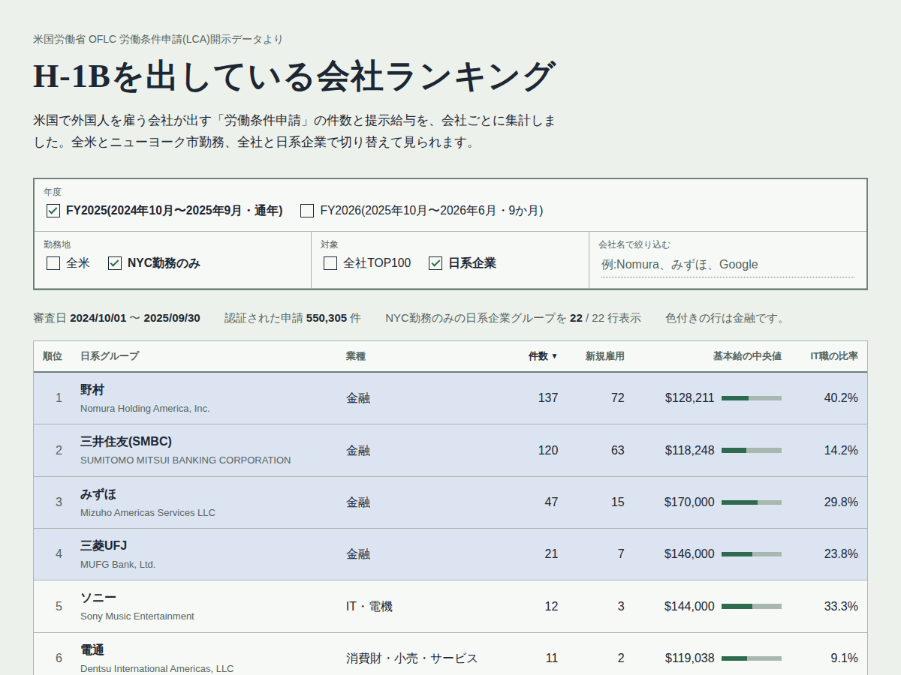

# H-1Bを出している会社ランキング(米国労働省LCAデータ)

米国労働省が公開している「労働条件申請(LCA)」のデータから、H-1Bなどの就労ビザを申請している会社をランキングにしたものです。全米とニューヨーク市(NYC)勤務、全社と日系企業で切り替えて見られます。

**ウェブで見る:** https://dkeikichi.github.io/FY2025-h1b-lca-ranking/



## わかること

- 全米で申請件数が多いのは、Amazon、Cognizant、Ernst & Young、Microsoft、Googleなどのテック企業・コンサル・インド系ITサービス会社です。日系企業は全米TOP100に入っていません。
- 日系企業で件数が多いのは日立(GlobalLogic)とNTTデータですが、勤務地はほぼテキサスなどでNYCはわずかです。
- NYC勤務に絞ると、日系の上位4社は野村、三井住友(SMBC)、みずほ、三菱UFJとすべて金融です(FY2025)。
- NYC勤務の基本給の中央値は、みずほが17万ドルと日系金融の中で高めです(FY2025)。

## 収録データ

| フォルダ | 期間(審査日) | 認証件数 |
|---|---|---|
| `data/fy2025/` | 2024年10月1日〜2025年9月30日(通年) | 550,305件 |
| `data/fy2026q3/` | 2025年10月1日〜2026年6月30日(9か月) | 401,412件 |

各フォルダには次のCSVがあります。

| ファイル | 内容 |
|---|---|
| `top100_us.csv` | 全社TOP100(全米) |
| `top100_nyc.csv` | 全社TOP100(NYC勤務のみ) |
| `japanese_us.csv` | 日系企業グループ別ランキング(全米) |
| `japanese_nyc.csv` | 日系企業グループ別ランキング(NYC勤務のみ) |
| `summary.json` | 集計に使ったファイル、期間、件数 |

ウェブページは、これらをまとめた `data/rankings.json` を読み込んで表示しています。`excel/LCA_analysis_FY2025.xlsx` は、FY2025の集計をExcelで確認できるようにしたものです(日系企業の全案件データと数式つき)。

### 列の意味

| 列 | 意味 |
|---|---|
| `cases` | 審査で認められた(Certified)申請の件数 |
| `nyc_cases` | そのうち勤務地がNYCの件数 |
| `new_hires` | そのうち新規雇用の件数 |
| `median_wage` | 提示賃金(基本給)の年額換算の中央値(USD) |
| `it_share` | IT職(SOCコード15-11・15-12)の比率 |
| `top_state` | 最も多い勤務州 |
| `jp_group` | 日系企業グループ名(日系でなければ空欄) |

## 集計方法

1. 米国労働省OFLCの「LCA Disclosure Data」(四半期ごとのxlsx)を読み込みます。
2. 同じ案件番号が複数のファイルに出てくる場合は、最新の審査結果だけを残します。
3. 審査結果が「Certified」の案件だけを数えます。
4. 給与は `WAGE_RATE_OF_PAY_FROM`(提示賃金の下限)を年額に直します(時給×2080、週給×52、隔週×26、月給×12)。年額2万ドル未満と200万ドル超は入力ミスとみなし、中央値の計算から除きます。
5. NYC勤務は、勤務州がNYで、市名がマンハッタン、ブルックリン、ブロンクス、クイーンズ、スタテンアイランドなどの案件です。ジャージーシティ(NJ)は含みません。
6. 全社TOP100は申請法人単位です。社名の表記ゆれ(Inc.、LLC、句読点など)だけをそろえ、親会社での合算はしていません。
7. 日系企業は `scripts/jp_companies.py` の社名パターンで判定し、親会社グループ単位で合算します。

## 注意点

- 件数は採用人数ではありません。LCAは更新や勤務地の変更でも提出されます。
- 給与は基本給だけで、ボーナスや株式報酬は含みません。金融機関では実際の総報酬よりかなり低く出ます。
- 日系企業が日本から社員を送るときに使うEビザ・L-1ビザは、このデータに含まれません。
- 日系企業の判定は社名によるため、漏れや誤判定があり得ます。見つけたらIssueやPull Requestで教えてください。
- USスチールが日本製鉄の傘下に入ったのは2025年6月です。FY2025にはそれ以前の申請も含まれます。
- この集計は公開データをもとにした個人の分析で、移民・法律上の助言ではありません。

## データを更新する

新しい四半期のデータが公開されたら、次の手順で作り直せます。

1. [米国労働省 Performance Data](https://www.dol.gov/agencies/eta/foreign-labor/performance) の「Disclosure Data」から `LCA_Disclosure_Data_FY20XX_QX.xlsx` をダウンロードし、`raw/` に置きます(`raw/` はGitに含めません。元ファイルは100MBを超えることがあり、GitHubに置けないためです)。
2. 集計します。

```bash
pip install -r scripts/requirements.txt

# 例:FY2025の4四半期分をまとめて集計
python scripts/build_rankings.py --label fy2025 raw/LCA_Disclosure_Data_FY2025_Q*.xlsx

# ウェブページ用のJSONを作り直す
python scripts/export_json.py
```

3. 新しい年度を追加した場合は、`scripts/export_json.py` の `LABELS` に表示名を追加してください。

手元でページを確認するときは、リポジトリのフォルダで次を実行して http://localhost:8000 を開きます(HTMLを直接開くとデータを読み込めません)。

```bash
python -m http.server
```

## フォルダ構成

```
.
├── index.html              ウェブページ
├── assets/                 CSS・JavaScript・スクリーンショット
├── data/                   集計結果(CSV・JSON)
├── excel/                  Excel版の集計
└── scripts/
    ├── build_rankings.py   LCAのxlsxからランキングを作る
    ├── export_json.py      ウェブページ用のJSONを作る
    ├── jp_companies.py     日系企業の判定リスト
    └── requirements.txt
```

## 出典とライセンス

- データの出典:U.S. Department of Labor, Employment and Training Administration, Office of Foreign Labor Certification, [Performance Data](https://www.dol.gov/agencies/eta/foreign-labor/performance)(LCA Disclosure Data)。米国連邦政府の著作物で、パブリックドメインです。
- このリポジトリのコード:MITライセンス(`LICENSE` を参照)。
